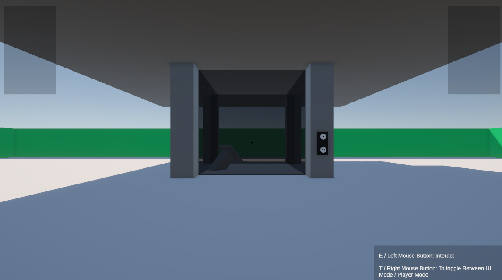
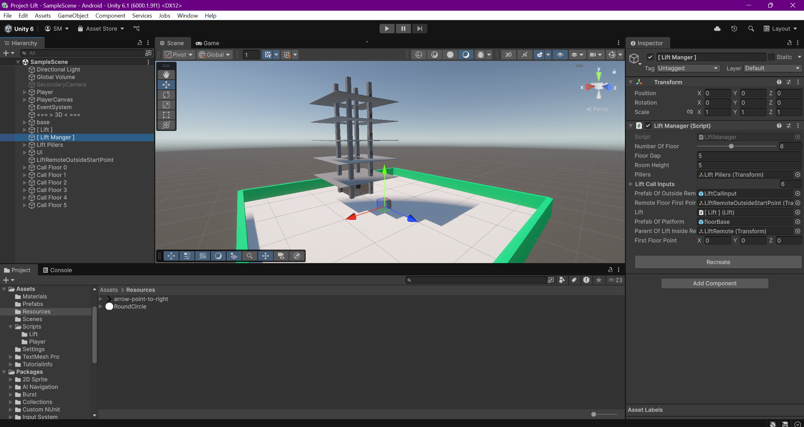

# 🚀 Project-Lift

A working Unity demo showcasing an interactive lift (elevator) system with player controls, UI mode toggling, and interaction mechanics.

---

## 🎮 Key Features

- ✅ Direction-based Lift Call & Movement
- ✅ Door Open/Close Animation
- ✅ Auto door open when collied with player
- ✅ Player Interaction System (Raycast-based)
- ✅ Character Controller for Player Movement
- ✅ UI Mode Toggle for Cursor-based UI

---

## 🎮 Controls

| Action               | Key/Button                  |
| -------------------- | --------------------------- |
| Toggle UI Mode       | `T` or `Right Mouse Button` |
| Interact with Object | `E` or `Left Mouse Button`  |
| Move Player          | `W`, `A`, `S`, `D`          |
| Jump                 | `Spacebar`                  |
| Run                  | `Left Shift`                |
| Look Around          | Mouse Movement              |

---

## 📦 Core Scripts

### 🔹 `Lift.cs`

Handles individual lift behavior:

- Floor queueing (up/down)
- Door animation
- Movement logic

### 🔹 `LiftManager.cs`

Manages all lift instances and defines:

- Number of floors
- Floor positions
- Room height

### 🔹 `PlayerControl.cs`

Handles:

- Character movement using `CharacterController`
- UI mode toggle
- Raycast-based interaction system

---

## 🛠️ Requirements

- Unity 6000.0.0 or newer
- New Input System Package (enabled)
- Tag `"Lift"` must be assigned to all lift platforms

---

## 📝 Notes

- Player is synced with moving lift using platform delta movement logic (not parenting).
- Cursor lock state is managed via toggle for gameplay vs UI interaction modes.

---

## 📷 Preview

---
